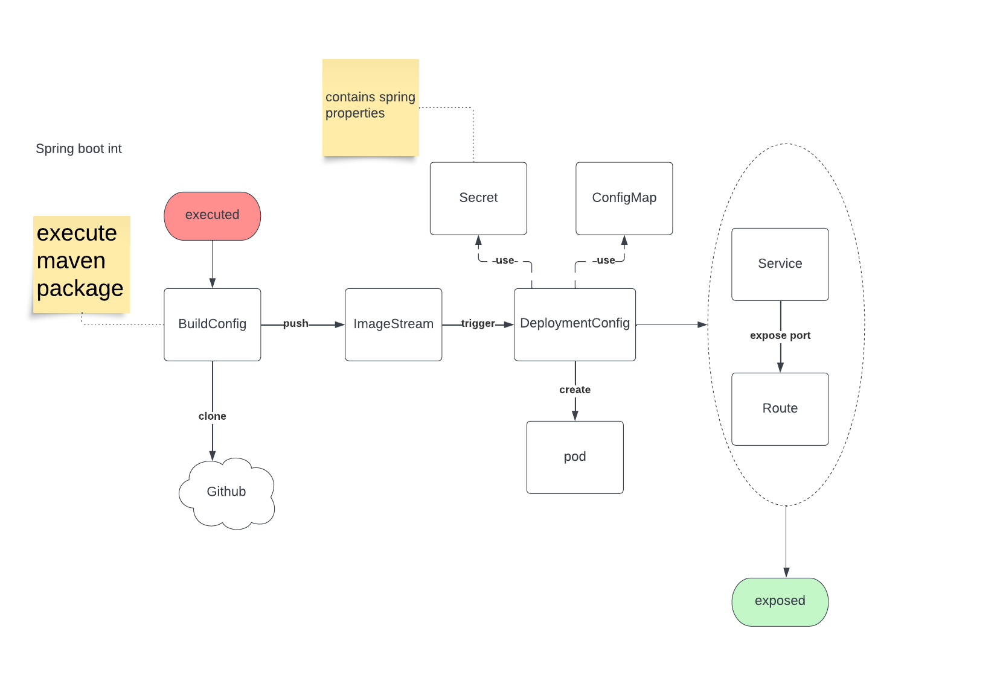

# Installation on Openshift Container Plateform
## Useful Links
### console
#### how to create a sandbox
Read more [here](./Sandbox.md) 

### access to swagger  
https://openshift-spring-workshop-giulianf1984-dev.apps.sandbox-m3.1530.p1.openshiftapps.com/swagger

# Getting started
## structure repository
  
### yaml
Yaml contains applied configuration on Openshift plateform  
  

### development / test
Use ImageStream (image into cluster) to avoid using application docker file into artifactory. 
Using Imagestram has several benefits: 
* You can tag, rollback a tag, and quickly deal with images, without having to re-push using the command line. 
* You can trigger Builds and Deployments when a new image is pushed to the registry.

#### Spring boot flow
  
#### Angular flow
  

