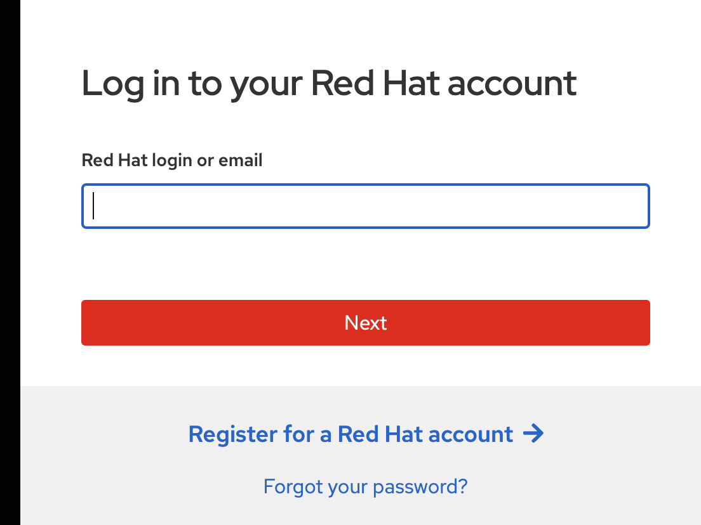
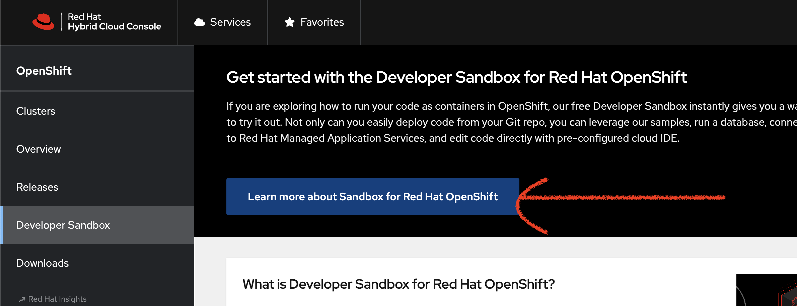
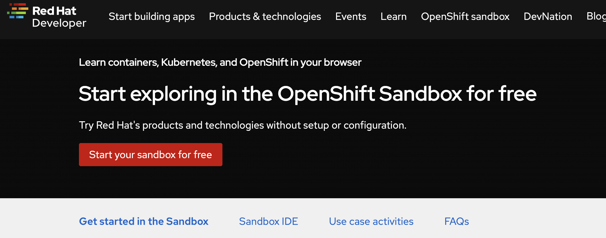

# Installation on Openshift Container Plateform
### Useful Links
#### console
##### how to create a sandbox
Pre-required
Create AWS account
1. https://console.redhat.com/openshift/sandbox
2. if you don't have redhat account create a new one  
   
3. verify your account
4. Go back to https://console.redhat.com/openshift/sandbox and logged in with your credential
5. click on "Learn more about Sandbox for Red Hat Openshift"  
   
6. Start sandbox for free and update your personal info  
   
7. Fill in you phone number for validation 
8. Your are now able to access your sandbox

